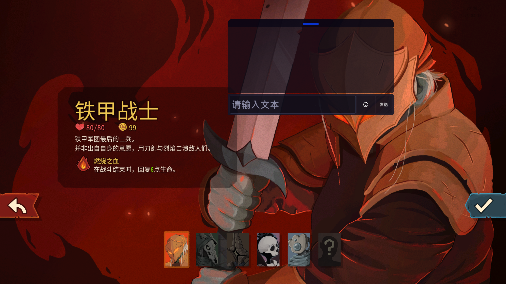

# STS2 Typing Mobile

移动端适配版的 [STS2 Typing](https://github.com/Shiroim/sts2_typing)，基于 wsdx 大佬的移植版进行优化。

## 主要修改

- 消息输入区域和消息显示区域改为常驻
- 移除 enter 和 esc 键的功能以适配移动端
- 修改了中文的输入框占位符
- Emoji 弹出窗口现在可以点击其他区域收回
- 消息显示区域可以通过滑动查看历史消息
- 新增拖拽条，功能为：
  - 拖动拖拽条可以改变消息窗口位置
  - 点击拖拽条可以收起/展开消息窗口

## 预览效果

### 正常状态

### 收起状态

## 尚未实现的功能

- Alt+左键的分享功能（还没想好在手机端如何交互）
- 其他语言的输入框 placeholder 适配（懒得做）